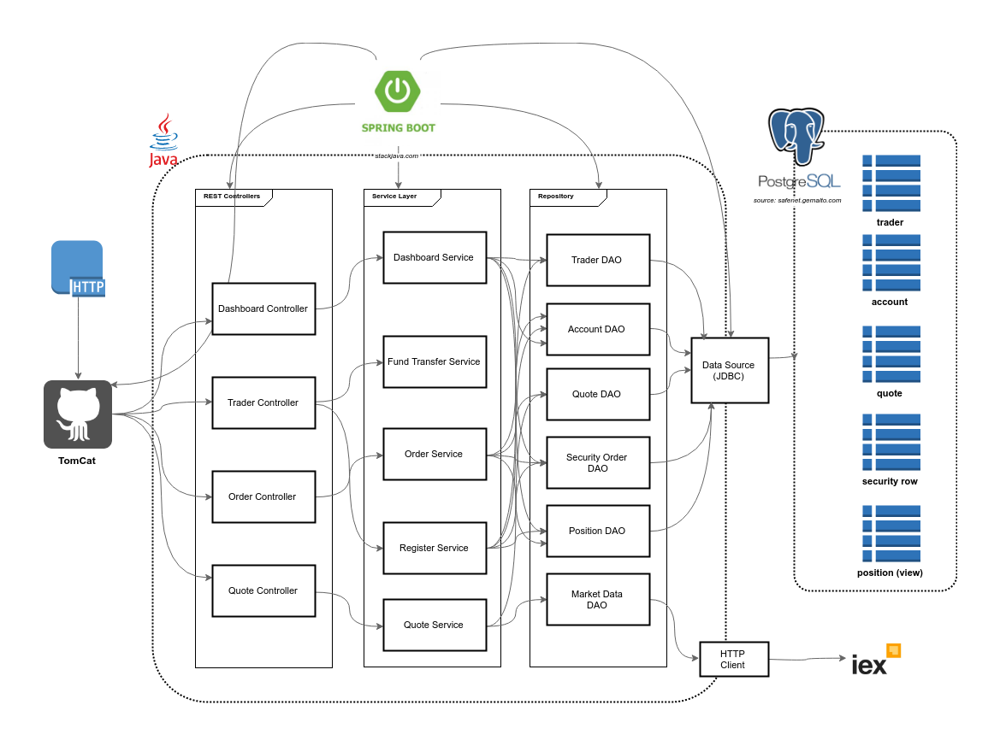
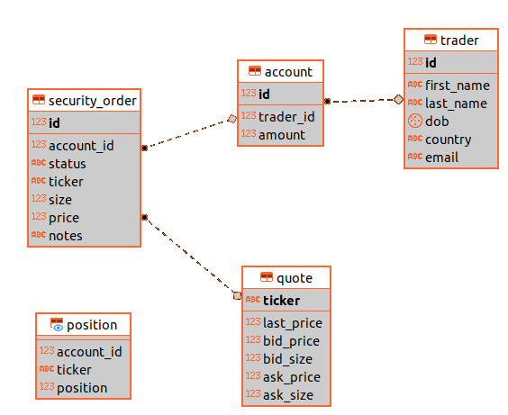

# Introduction

A trading application that simulates managing stocks associated with an account. The target users for this app are front-end, full-stack, and back-end(testing purposes) developers. This app is an example of microservices that uses [IEX API](https://iexcloud.io/) to retrieve stock data and stores information using a Postgres database.

- [Quick Start](#quick-start)
    - [Git clone and Maven build](#git-clone-and-maven-build)
    - [Postgres initialization](#postgres-initialization)
    - [How to consume REST API?](#how-to-consume-rest-api)
- [REST API Usage](#rest-api-usage)
    - [Swagger](#swagger)
    - [Quote controller](#quote-controller)
    - [Trader controller](#trader-controller)
    - [Order controller](#order-controller)
    - [App controller](#app-controller)
    - [Dashboard controller](#dashboard-controller)
- [Architecture](#architecture)
    - [Controller](#controller)
    - [Service](#service)
    - [DAO](#dao)
    - [SpringBoot](#springboot)
    - [Postgres and Iex](#postgres-and-iex)
- [Improvements](#improvements)

## Quick Start
**Prerequisites:** Java 1.8, Docker 10.x, CentOS 7

The following is the start-up script for this app. It will start docker, set up the required database setup and environment variables.
```bash
#!/bin/bash
set -e
cd "$(dirname "$0")"
​
ls lib/trading-1.0-SNAPSHOT.jar
​
if [ "$#" -ne 5 ]; then
    echo "Illegal number of parameters"
    exit 1
fi
​
export SPRING_PROFILES_ACTIVE=$1
export PSQL_HOST=$2
export PSQL_USER=$3
export PSQL_PASSWORD=$4
export IEX_PUB_TOKEN=$5
export PGPASSWORD=$PSQL_PASSWORD
export PSQL_URL="jdbc:postgresql://${PSQL_HOST}:5432/jrvstrading"

#set up application-specific environment variables 
​export iex.host=https://cloud-sse.iexapis.com/stable
export iex.token=$IEX_PUB_TOKEN
export app.db.driver=org.postgresql.Driver
export app.db.url=PSQL_URL
export app.init.dailyList=msft,goog,amzn
export app.db.user=$PSQL_USER
export app.db.password=$PSQL_PASSWORD

#start docker
systemctl status docker || systemctl start docker || sleep 5
​
#create docker volume to persist db data
docker volume ls | grep "pgdata" || docker volume create pgdata || sleep 1
​
#stop existing jrvs-psql container
docker ps | grep jrvs-psql && docker stop $(docker ps | grep jrvs-psql | awk '{print $1}')
​
#start docker
docker run --rm --name jrvs-psql -e POSTGRES_PASSWORD=$PSQL_PASSWORD -d -v pgdata:/var/lib/postgresql/data -p 5432:5432 $PSQL_USER
sleep 5
​
psql -h $PSQL_HOST -U $PSQL_USER -f ./sql_ddl/init_db.sql
psql -h $PSQL_HOST -U $PSQL_USER -d jrvstrading -f ./sql_ddl/schema.sql
​
#run springboot app
/usr/bin/java -jar ./lib/trading-1.0-SNAPSHOT.jar
```

### Git clone and Maven build
The following commands will grab and run the application:
```
git clone https://github.com/mazh-jarvis/trading.git
mvn clean package -DskipTests
```

### Postgres initialization
Database schema:
```sql
-- Drop any existing tables
DROP TABLE IF EXISTS public.trader cascade;
DROP TABLE IF EXISTS public.account cascade;
DROP TABLE IF EXISTS public.security_order cascade;
DROP TABLE IF EXISTS public.quote cascade;

-- DO NOT use double quote, e.g. public.trader."trader"
CREATE TABLE public.trader
(
  id         serial  NOT NULL,
  first_name varchar NOT NULL,
  last_name  varchar NOT NULL,
  dob        date    NOT NULL,
  country    varchar NOT NULL,
  email      varchar NOT NULL,
  CONSTRAINT trader_pk PRIMARY KEY (id)
);

CREATE TABLE public.account
(
  id        serial NOT NULL,
  trader_id int4   NOT NULL,
  amount    float8 NOT NULL,
  CONSTRAINT account_pk PRIMARY KEY (id),
  CONSTRAINT account_trader_fk FOREIGN KEY (trader_id) REFERENCES trader (id)
);

CREATE TABLE public.quote
(
  ticker     varchar NOT NULL,
  last_price float8  NOT NULL,
  bid_price  float8  NOT NULL,
  bid_size   int4    NOT NULL,
  ask_price  float8  NOT NULL,
  ask_size   int4    NOT NULL,
  CONSTRAINT quote_pk PRIMARY KEY (ticker)
);

CREATE TABLE public.security_order
(
  id         serial  NOT NULL,
  account_id int4    NOT NULL,
  status     varchar NOT NULL,
  ticker     varchar NOT NULL,
  "size"     int4    NOT NULL,
  price      float8  NULL,
  notes      varchar NULL,
  CONSTRAINT security_order_pk PRIMARY KEY (id),
  CONSTRAINT security_order_account_fk FOREIGN KEY (account_id) REFERENCES account (id),
  CONSTRAINT security_order_quote_fk FOREIGN KEY (ticker) REFERENCES quote (ticker)
);


DROP VIEW IF EXISTS public.position;

CREATE OR REPLACE VIEW public.position
AS
SELECT account_id,
       ticker,
       sum(size) AS position
FROM public.security_order
WHERE status = 'FILLED'
GROUP BY account_id, ticker;
```

Database initialization script:
```sql
CREATE DATABASE jrvstrading;
GRANT ALL PRIVILEGES ON DATABASE jrvstrading TO postgres;

--db for test case
CREATE DATABASE jrvstrading_test;
GRANT ALL PRIVILEGES ON DATABASE jrvstrading_test TO postgres;
```
### How to consume REST API?
Todo(use swagger generator)

# Rest API Usage
## Swagger
todo
## Quote controller
todo
## Trader controller
todo
## Order controller
todo
## App controller
todo
## Dashboard controller
todo

# Architecture
### Class diagram


### Entity relationship


### Controller
todo
### Service
todo
### DAO
todo
### SpringBoot
todo
### Postgres and IEX
todo

# Improvements
todo (5+ points)