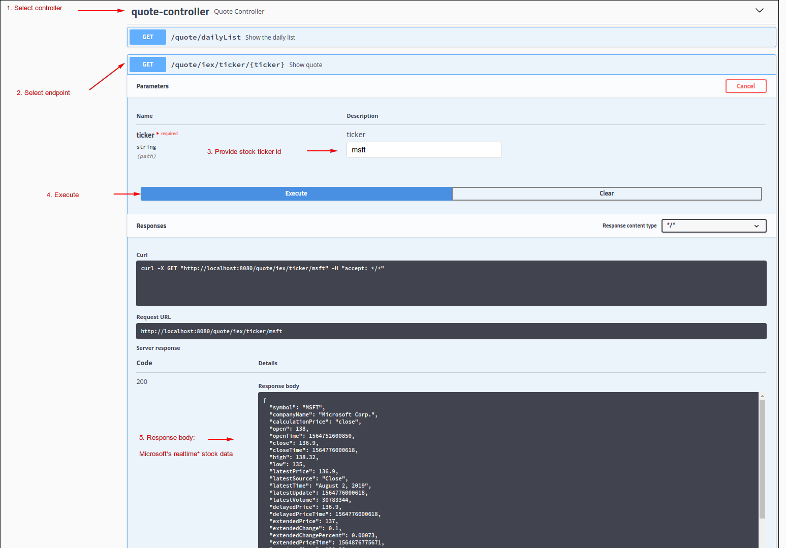
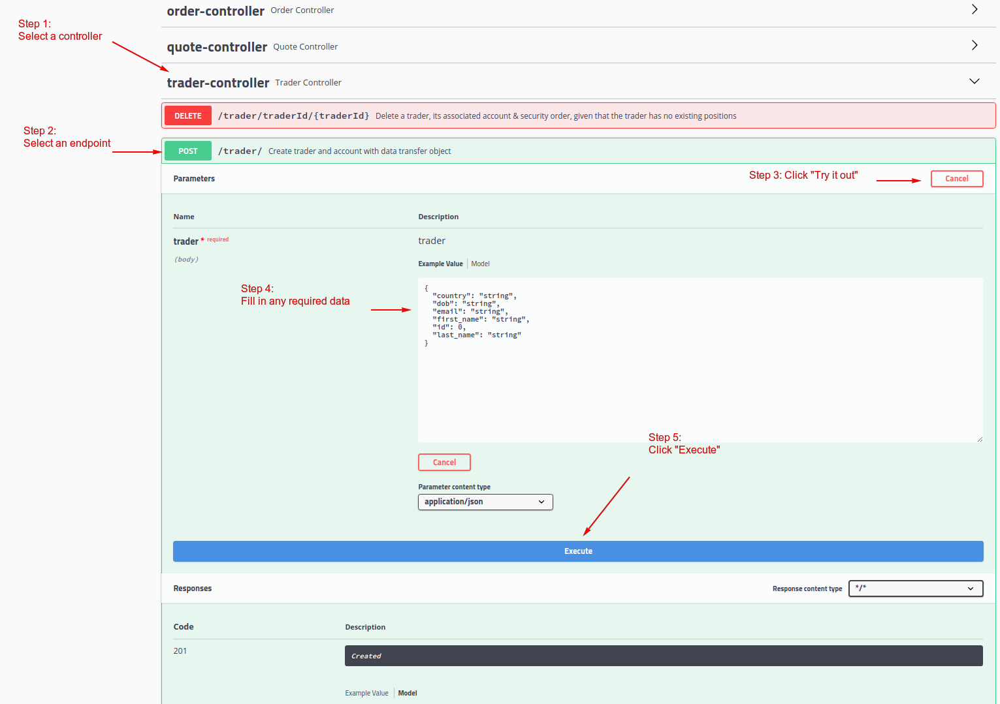
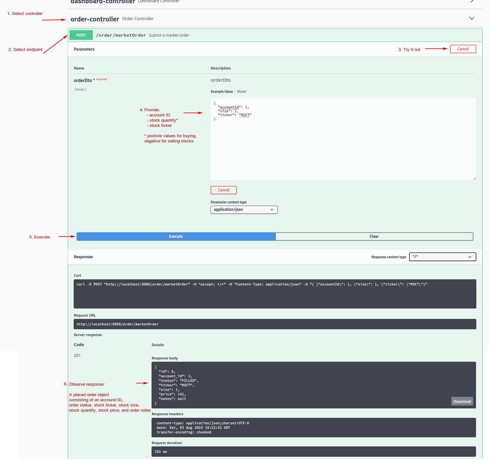
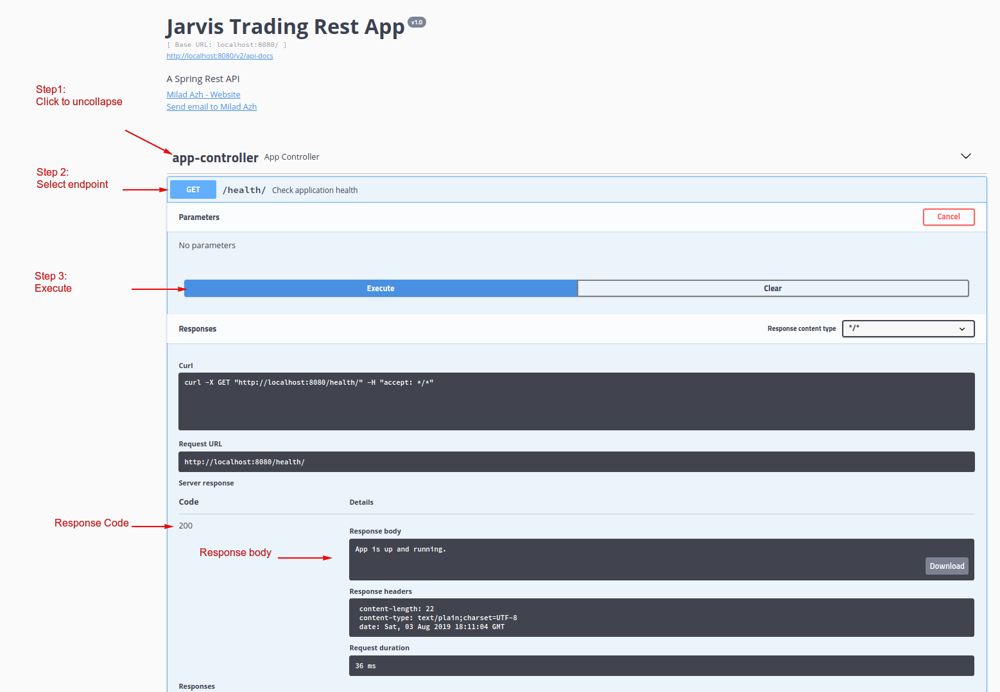
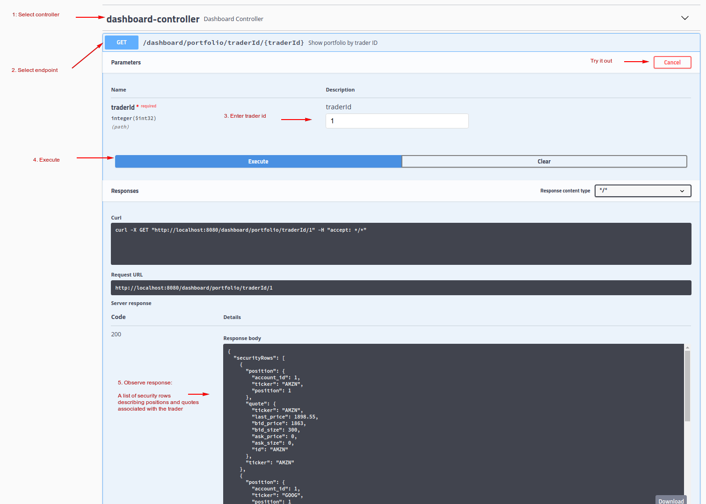

# Introduction

A trading application that simulates managing stocks associated with an account. The target users for this app are front-end, full-stack, and back-end(testing purposes) developers. This app is an example of microservices that uses [IEX API](https://iexcloud.io/) to retrieve stock data and stores information using a Postgres database.

- [Quick Start](#quick-start)
    - [Git clone and Maven build](#git-clone-and-maven-build)
    - [Postgres initialization](#postgres-initialization)
    - [How to consume REST API?](#how-to-consume-rest-api)
- [REST API Usage](#rest-api-usage)
    - [Swagger](#swagger)
    - [Quote controller](#quote-controller)
    - [Trader controller](#trader-controller)
    - [Order controller](#order-controller)
    - [App controller](#app-controller)
    - [Dashboard controller](#dashboard-controller)
- [Architecture](#architecture)
    - [Controller](#controller)
    - [Service](#service)
    - [DAO](#dao)
    - [SpringBoot](#springboot)
    - [Postgres and Iex](#postgres-and-iex)
- [Improvements](#improvements)

## Quick Start
**Prerequisites:** Java 1.8, Docker 10.x, CentOS 7

The following is the start-up script for this app. It will start docker, set up the required database setup and environment variables.
```bash
#!/bin/bash
set -e
cd "$(dirname "$0")"
​
ls lib/trading-1.0-SNAPSHOT.jar
​
if [ "$#" -ne 5 ]; then
    echo "Illegal number of parameters"
    exit 1
fi
​
export SPRING_PROFILES_ACTIVE=$1
export PSQL_HOST=$2
export PSQL_USER=$3
export PSQL_PASSWORD=$4
export IEX_PUB_TOKEN=$5
export PGPASSWORD=$PSQL_PASSWORD
export PSQL_URL="jdbc:postgresql://${PSQL_HOST}:5432/jrvstrading"

#set up application-specific environment variables 
env "iex.host=https://cloud-sse.iexapis.com/stable" bash
env "iex.token=$IEX_PUB_TOKEN" bash
env "app.db.driver=org.postgresql.Driver" bash
env "app.db.url=PSQL_URL" bash
env "app.init.dailyList=msft,goog,amzn" bash
env "app.db.user=$PSQL_USER" bash
env "app.db.password=$PSQL_PASSWORD" bash

#start docker
systemctl status docker || systemctl start docker || sleep 5
​
#create docker volume to persist db data
docker volume ls | grep "pgdata" || docker volume create pgdata || sleep 1
​
#stop existing jrvs-psql container
docker ps | grep jrvs-psql && docker stop $(docker ps | grep jrvs-psql | awk '{print $1}')
​
#start docker
docker run --rm --name jrvs-psql -e POSTGRES_PASSWORD=$PSQL_PASSWORD -d -v pgdata:/var/lib/postgresql/data -p 5432:5432 $PSQL_USER
sleep 5
​
psql -h $PSQL_HOST -U $PSQL_USER -f ./sql_ddl/init_db.sql
psql -h $PSQL_HOST -U $PSQL_USER -d jrvstrading -f ./sql_ddl/schema.sql
​
#run springboot app
/usr/bin/java -jar ./lib/trading-1.0-SNAPSHOT.jar
```

### Postgres initialization
Database schema:
```sql
-- Drop any existing tables
DROP TABLE IF EXISTS public.trader cascade;
DROP TABLE IF EXISTS public.account cascade;
DROP TABLE IF EXISTS public.security_order cascade;
DROP TABLE IF EXISTS public.quote cascade;

-- DO NOT use double quote, e.g. public.trader."trader"
CREATE TABLE public.trader
(
  id         serial  NOT NULL,
  first_name varchar NOT NULL,
  last_name  varchar NOT NULL,
  dob        date    NOT NULL,
  country    varchar NOT NULL,
  email      varchar NOT NULL,
  CONSTRAINT trader_pk PRIMARY KEY (id)
);

CREATE TABLE public.account
(
  id        serial NOT NULL,
  trader_id int4   NOT NULL,
  amount    float8 NOT NULL,
  CONSTRAINT account_pk PRIMARY KEY (id),
  CONSTRAINT account_trader_fk FOREIGN KEY (trader_id) REFERENCES trader (id)
);

CREATE TABLE public.quote
(
  ticker     varchar NOT NULL,
  last_price float8  NOT NULL,
  bid_price  float8  NOT NULL,
  bid_size   int4    NOT NULL,
  ask_price  float8  NOT NULL,
  ask_size   int4    NOT NULL,
  CONSTRAINT quote_pk PRIMARY KEY (ticker)
);

CREATE TABLE public.security_order
(
  id         serial  NOT NULL,
  account_id int4    NOT NULL,
  status     varchar NOT NULL,
  ticker     varchar NOT NULL,
  "size"     int4    NOT NULL,
  price      float8  NULL,
  notes      varchar NULL,
  CONSTRAINT security_order_pk PRIMARY KEY (id),
  CONSTRAINT security_order_account_fk FOREIGN KEY (account_id) REFERENCES account (id),
  CONSTRAINT security_order_quote_fk FOREIGN KEY (ticker) REFERENCES quote (ticker)
);


DROP VIEW IF EXISTS public.position;

CREATE OR REPLACE VIEW public.position
AS
SELECT account_id,
       ticker,
       sum(size) AS position
FROM public.security_order
WHERE status = 'FILLED'
GROUP BY account_id, ticker;
```

Database initialization script:
```sql
CREATE DATABASE jrvstrading;
GRANT ALL PRIVILEGES ON DATABASE jrvstrading TO postgres;

--db for test case
CREATE DATABASE jrvstrading_test;
GRANT ALL PRIVILEGES ON DATABASE jrvstrading_test TO postgres;
```

### Git clone and Maven build
The following commands will grab and run the application:
```bash
git clone https://github.com/mazh-jarvis/trading.git
mvn clean package -DskipTests
```

### How to consume REST API?
[Postman](https://www.getpostman.com/) is a great application to test the REST API.
- Make sure the application server is running.
- Copy the following configuration and import it into Postman as *raw text*:
```json
{
  "swagger": "2.0",
  "info": {
    "description": "A Spring Rest API",
    "version": "v1.0",
    "title": "Jarvis Trading Rest App",
    "contact": {
      "name": "Milad Azh",
      "url": "jrvs.ca",
      "email": "milad.azh.jrvs.ca@gmail.com"
    }
  },
  "host": "localhost:8080",
  "basePath": "/",
  "tags": [
    {
      "name": "dashboard-controller",
      "description": "Dashboard Controller"
    },
    {
      "name": "order-controller",
      "description": "Order Controller"
    },
    {
      "name": "quote-controller",
      "description": "Quote Controller"
    },
    {
      "name": "trader-controller",
      "description": "Trader Controller"
    }
  ],
  "paths": {
    "/dashboard/portfolio/traderId/{traderId}": {
      "get": {
        "tags": [
          "dashboard-controller"
        ],
        "summary": "Show portfolio by trader ID",
        "operationId": "showPortfolioUsingGET",
        "produces": [
          "*/*"
        ],
        "parameters": [
          {
            "name": "traderId",
            "in": "path",
            "description": "traderId",
            "required": true,
            "type": "integer",
            "format": "int32"
          }
        ],
        "responses": {
          "200": {
            "description": "OK",
            "schema": {
              "$ref": "#/definitions/PortfolioView"
            }
          },
          "401": {
            "description": "Unauthorized"
          },
          "403": {
            "description": "Forbidden"
          },
          "404": {
            "description": "Not Found"
          }
        },
        "deprecated": false
      }
    },
    "/dashboard/profile/traderId/{traderId}": {
      "get": {
        "tags": [
          "dashboard-controller"
        ],
        "summary": "Show trader profile by trader ID",
        "operationId": "showProfileUsingGET",
        "produces": [
          "*/*"
        ],
        "parameters": [
          {
            "name": "traderId",
            "in": "path",
            "description": "traderId",
            "required": true,
            "type": "integer",
            "format": "int32"
          }
        ],
        "responses": {
          "200": {
            "description": "OK",
            "schema": {
              "$ref": "#/definitions/TraderAccountView"
            }
          },
          "401": {
            "description": "Unauthorized"
          },
          "403": {
            "description": "Forbidden"
          },
          "404": {
            "description": "Not Found"
          }
        },
        "deprecated": false
      }
    },
    "/order/marketOrder": {
      "post": {
        "tags": [
          "order-controller"
        ],
        "summary": "Submit a market order",
        "operationId": "orderUsingPOST",
        "consumes": [
          "application/json"
        ],
        "produces": [
          "*/*"
        ],
        "parameters": [
          {
            "in": "body",
            "name": "orderDto",
            "description": "orderDto",
            "required": true,
            "schema": {
              "$ref": "#/definitions/MarketOrderDto"
            }
          }
        ],
        "responses": {
          "201": {
            "description": "Created",
            "schema": {
              "$ref": "#/definitions/SecurityOrder"
            }
          },
          "401": {
            "description": "Unauthorized"
          },
          "403": {
            "description": "Forbidden"
          },
          "404": {
            "description": "Not Found"
          }
        },
        "deprecated": false
      }
    },
    "/quote/": {
      "put": {
        "tags": [
          "quote-controller"
        ],
        "summary": "Update a given quote in the data source",
        "operationId": "putQuoteUsingPUT",
        "consumes": [
          "application/json"
        ],
        "produces": [
          "*/*"
        ],
        "parameters": [
          {
            "in": "body",
            "name": "quote",
            "description": "quote",
            "required": true,
            "schema": {
              "$ref": "#/definitions/Quote"
            }
          }
        ],
        "responses": {
          "200": {
            "description": "OK"
          },
          "201": {
            "description": "Created"
          },
          "401": {
            "description": "Unauthorized"
          },
          "403": {
            "description": "Forbidden"
          },
          "404": {
            "description": "Not Found"
          }
        },
        "deprecated": false
      }
    },
    "/quote/dailyList": {
      "get": {
        "tags": [
          "quote-controller"
        ],
        "summary": "Show the daily list",
        "operationId": "getDailyListUsingGET",
        "produces": [
          "*/*"
        ],
        "responses": {
          "200": {
            "description": "OK",
            "schema": {
              "type": "array",
              "items": {
                "$ref": "#/definitions/Quote"
              }
            }
          },
          "401": {
            "description": "Unauthorized"
          },
          "403": {
            "description": "Forbidden"
          },
          "404": {
            "description": "Not Found"
          }
        },
        "deprecated": false
      }
    },
    "/quote/iex/ticker/{ticker}": {
      "get": {
        "tags": [
          "quote-controller"
        ],
        "summary": "Show quote",
        "operationId": "getQuoteUsingGET",
        "produces": [
          "*/*"
        ],
        "parameters": [
          {
            "name": "ticker",
            "in": "path",
            "description": "ticker",
            "required": true,
            "type": "string"
          }
        ],
        "responses": {
          "200": {
            "description": "OK",
            "schema": {
              "$ref": "#/definitions/IexQuote"
            }
          },
          "401": {
            "description": "Unauthorized"
          },
          "403": {
            "description": "Forbidden"
          },
          "404": {
            "description": "Not Found"
          }
        },
        "deprecated": false
      }
    },
    "/quote/iexMarketData": {
      "put": {
        "tags": [
          "quote-controller"
        ],
        "summary": "Update the quote data source using the Iex data",
        "operationId": "updateMarketDataUsingPUT",
        "consumes": [
          "application/json"
        ],
        "produces": [
          "*/*"
        ],
        "responses": {
          "200": {
            "description": "OK"
          },
          "201": {
            "description": "Created"
          },
          "401": {
            "description": "Unauthorized"
          },
          "403": {
            "description": "Forbidden"
          },
          "404": {
            "description": "Not Found"
          }
        },
        "deprecated": false
      }
    },
    "/quote/tickerId/{tickerId}": {
      "post": {
        "tags": [
          "quote-controller"
        ],
        "summary": "Add a new ticker to the daily list",
        "operationId": "createQuoteUsingPOST",
        "consumes": [
          "application/json"
        ],
        "produces": [
          "*/*"
        ],
        "parameters": [
          {
            "name": "tickerId",
            "in": "path",
            "description": "tickerId",
            "required": true,
            "type": "string"
          }
        ],
        "responses": {
          "201": {
            "description": "Created"
          },
          "401": {
            "description": "Unauthorized"
          },
          "403": {
            "description": "Forbidden"
          },
          "404": {
            "description": "Not Found"
          }
        },
        "deprecated": false
      }
    },
    "/trader/": {
      "post": {
        "tags": [
          "trader-controller"
        ],
        "summary": "Create trader and account with data transfer object",
        "operationId": "createTraderUsingPOST",
        "consumes": [
          "application/json"
        ],
        "produces": [
          "*/*"
        ],
        "parameters": [
          {
            "in": "body",
            "name": "trader",
            "description": "trader",
            "required": true,
            "schema": {
              "$ref": "#/definitions/Trader"
            }
          }
        ],
        "responses": {
          "201": {
            "description": "Created",
            "schema": {
              "$ref": "#/definitions/TraderAccountView"
            }
          },
          "401": {
            "description": "Unauthorized"
          },
          "403": {
            "description": "Forbidden"
          },
          "404": {
            "description": "Not Found"
          }
        },
        "deprecated": false
      }
    },
    "/trader/deposit/accountId/{accountId}/amount/{amount}": {
      "put": {
        "tags": [
          "trader-controller"
        ],
        "summary": "Deposit funds to an existing account",
        "operationId": "depositFundsUsingPUT",
        "consumes": [
          "application/json"
        ],
        "produces": [
          "application/json;charset=UTF-8"
        ],
        "parameters": [
          {
            "name": "accountId",
            "in": "path",
            "description": "accountId",
            "required": true,
            "type": "integer",
            "format": "int32"
          },
          {
            "name": "amount",
            "in": "path",
            "description": "amount",
            "required": true,
            "type": "number",
            "format": "double"
          }
        ],
        "responses": {
          "201": {
            "description": "Created"
          },
          "202": {
            "description": "Accepted",
            "schema": {
              "$ref": "#/definitions/Account"
            }
          },
          "401": {
            "description": "Unauthorized"
          },
          "403": {
            "description": "Forbidden"
          },
          "404": {
            "description": "Not Found"
          }
        },
        "deprecated": false
      }
    },
    "/trader/firstname/{firstname}/lastname/{lastname}/dob/{dob}/country/{country}/email/{email}": {
      "post": {
        "tags": [
          "trader-controller"
        ],
        "summary": "Create a trader and associated account",
        "operationId": "createTraderUsingPOST_1",
        "consumes": [
          "application/json"
        ],
        "produces": [
          "application/json;charset=UTF-8"
        ],
        "parameters": [
          {
            "name": "country",
            "in": "path",
            "description": "country",
            "required": true,
            "type": "string"
          },
          {
            "name": "dob",
            "in": "path",
            "description": "dob",
            "required": true,
            "type": "string",
            "format": "date"
          },
          {
            "name": "email",
            "in": "path",
            "description": "email",
            "required": true,
            "type": "string"
          },
          {
            "name": "firstname",
            "in": "path",
            "description": "firstname",
            "required": true,
            "type": "string"
          },
          {
            "name": "lastname",
            "in": "path",
            "description": "lastname",
            "required": true,
            "type": "string"
          }
        ],
        "responses": {
          "201": {
            "description": "Created",
            "schema": {
              "$ref": "#/definitions/TraderAccountView"
            }
          },
          "401": {
            "description": "Unauthorized"
          },
          "403": {
            "description": "Forbidden"
          },
          "404": {
            "description": "Not Found"
          }
        },
        "deprecated": false
      }
    },
    "/trader/traderId/{traderId}": {
      "delete": {
        "tags": [
          "trader-controller"
        ],
        "summary": "Delete a trader, its associated account & security order, given that the trader has no existing positions",
        "operationId": "deleteTraderUsingDELETE",
        "produces": [
          "*/*"
        ],
        "parameters": [
          {
            "name": "traderId",
            "in": "path",
            "description": "traderId",
            "required": true,
            "type": "integer",
            "format": "int32"
          }
        ],
        "responses": {
          "202": {
            "description": "Accepted"
          },
          "204": {
            "description": "No Content"
          },
          "401": {
            "description": "Unauthorized"
          },
          "403": {
            "description": "Forbidden"
          }
        },
        "deprecated": false
      }
    },
    "/trader/withdraw/accountId/{accountId}/amount/{amount}": {
      "put": {
        "tags": [
          "trader-controller"
        ],
        "summary": "Withdraw funds from an existing account",
        "operationId": "withdrawFundsUsingPUT",
        "consumes": [
          "application/json"
        ],
        "produces": [
          "application/json;charset=UTF-8"
        ],
        "parameters": [
          {
            "name": "accountId",
            "in": "path",
            "description": "accountId",
            "required": true,
            "type": "integer",
            "format": "int32"
          },
          {
            "name": "amount",
            "in": "path",
            "description": "amount",
            "required": true,
            "type": "number",
            "format": "double"
          }
        ],
        "responses": {
          "201": {
            "description": "Created"
          },
          "202": {
            "description": "Accepted",
            "schema": {
              "$ref": "#/definitions/Account"
            }
          },
          "401": {
            "description": "Unauthorized"
          },
          "403": {
            "description": "Forbidden"
          },
          "404": {
            "description": "Not Found"
          }
        },
        "deprecated": false
      }
    }
  },
  "definitions": {
    "Account": {
      "type": "object",
      "properties": {
        "amount": {
          "type": "number",
          "format": "double"
        },
        "id": {
          "type": "integer",
          "format": "int32"
        },
        "trader_id": {
          "type": "integer",
          "format": "int32"
        }
      },
      "title": "Account"
    },
    "IexQuote": {
      "type": "object",
      "properties": {
        "avgTotalVolume": {
          "type": "integer",
          "format": "int64"
        },
        "calculationPrice": {
          "type": "string"
        },
        "change": {
          "type": "number",
          "format": "double"
        },
        "changePercent": {
          "type": "number",
          "format": "double"
        },
        "close": {
          "type": "number",
          "format": "double"
        },
        "closeTime": {
          "type": "integer",
          "format": "int64"
        },
        "companyName": {
          "type": "string"
        },
        "delayedPrice": {
          "type": "number",
          "format": "double"
        },
        "delayedPriceTime": {
          "type": "integer",
          "format": "int64"
        },
        "extendedChange": {
          "type": "number",
          "format": "double"
        },
        "extendedChangePercent": {
          "type": "number",
          "format": "double"
        },
        "extendedPrice": {
          "type": "integer",
          "format": "int64"
        },
        "extendedPriceTime": {
          "type": "integer",
          "format": "int64"
        },
        "high": {
          "type": "number",
          "format": "double"
        },
        "iexAskPrice": {
          "type": "number",
          "format": "double"
        },
        "iexAskSize": {
          "type": "integer",
          "format": "int64"
        },
        "iexBidPrice": {
          "type": "number",
          "format": "double"
        },
        "iexBidSize": {
          "type": "integer",
          "format": "int64"
        },
        "iexLastUpdated": {
          "type": "integer",
          "format": "int64"
        },
        "iexMarketPercent": {
          "type": "number",
          "format": "double"
        },
        "iexRealtimePrice": {
          "type": "integer",
          "format": "int64"
        },
        "iexRealtimeSize": {
          "type": "integer",
          "format": "int64"
        },
        "iexVolume": {
          "type": "integer",
          "format": "int64"
        },
        "lastTradeTime": {
          "type": "integer",
          "format": "int64"
        },
        "latestPrice": {
          "type": "number",
          "format": "double"
        },
        "latestSource": {
          "type": "string"
        },
        "latestTime": {
          "type": "string"
        },
        "latestUpdate": {
          "type": "integer",
          "format": "int64"
        },
        "latestVolume": {
          "type": "integer",
          "format": "int64"
        },
        "low": {
          "type": "integer",
          "format": "int64"
        },
        "marketCap": {
          "type": "integer",
          "format": "int64"
        },
        "open": {
          "type": "integer",
          "format": "int64"
        },
        "openTime": {
          "type": "integer",
          "format": "int64"
        },
        "peRatio": {
          "type": "object"
        },
        "previousClose": {
          "type": "number",
          "format": "double"
        },
        "symbol": {
          "type": "string"
        },
        "week52High": {
          "type": "number",
          "format": "double"
        },
        "week52Low": {
          "type": "number",
          "format": "double"
        },
        "ytdChange": {
          "type": "number",
          "format": "double"
        }
      },
      "title": "IexQuote"
    },
    "MarketOrderDto": {
      "type": "object",
      "properties": {
        "accountId": {
          "type": "integer",
          "format": "int32"
        },
        "size": {
          "type": "integer",
          "format": "int32"
        },
        "ticker": {
          "type": "string"
        }
      },
      "title": "MarketOrderDto"
    },
    "PortfolioView": {
      "type": "object",
      "properties": {
        "securityRows": {
          "type": "array",
          "items": {
            "$ref": "#/definitions/SecurityRow"
          }
        }
      },
      "title": "PortfolioView"
    },
    "Position": {
      "type": "object",
      "properties": {
        "account_id": {
          "type": "integer",
          "format": "int32"
        },
        "position": {
          "type": "integer",
          "format": "int32"
        },
        "ticker": {
          "type": "string"
        }
      },
      "title": "Position"
    },
    "Quote": {
      "type": "object",
      "properties": {
        "ask_price": {
          "type": "number",
          "format": "double"
        },
        "ask_size": {
          "type": "integer",
          "format": "int64"
        },
        "bid_price": {
          "type": "number",
          "format": "double"
        },
        "bid_size": {
          "type": "integer",
          "format": "int64"
        },
        "id": {
          "type": "string"
        },
        "last_price": {
          "type": "number",
          "format": "double"
        },
        "ticker": {
          "type": "string"
        }
      },
      "title": "Quote"
    },
    "SecurityOrder": {
      "type": "object",
      "properties": {
        "account_id": {
          "type": "integer",
          "format": "int32"
        },
        "id": {
          "type": "integer",
          "format": "int32"
        },
        "notes": {
          "type": "string"
        },
        "price": {
          "type": "number",
          "format": "double"
        },
        "size": {
          "type": "integer",
          "format": "int32"
        },
        "status": {
          "type": "string"
        },
        "ticker": {
          "type": "string"
        }
      },
      "title": "SecurityOrder"
    },
    "SecurityRow": {
      "type": "object",
      "properties": {
        "position": {
          "$ref": "#/definitions/Position"
        },
        "quote": {
          "$ref": "#/definitions/Quote"
        },
        "ticker": {
          "type": "string"
        }
      },
      "title": "SecurityRow"
    },
    "Trader": {
      "type": "object",
      "properties": {
        "country": {
          "type": "string"
        },
        "dob": {
          "type": "string",
          "format": "date"
        },
        "email": {
          "type": "string"
        },
        "first_name": {
          "type": "string"
        },
        "id": {
          "type": "integer",
          "format": "int32"
        },
        "last_name": {
          "type": "string"
        }
      },
      "title": "Trader"
    },
    "TraderAccountView": {
      "type": "object",
      "properties": {
        "account": {
          "$ref": "#/definitions/Account"
        },
        "trader": {
          "$ref": "#/definitions/Trader"
        }
      },
      "title": "TraderAccountView"
    }
  }
}
```

# Rest API Usage
## Swagger
[Swagger](https://swagger.io/) provides a simple web interface in order to interact with the Trader App API.

The user will receive a response(or an error), after submitting a request.

Certain requests require the user to fill in some data before submission.

## Quote controller
The quote controller manages endpoints for an entity representing a stock quote, consisting of a ticker as the identifier, ask price, bid price, and the latest price.

Example:

## Trader controller
The trader controller manages endpoints for an entity representing an individual with an associated account.

Personal information of a trader include their first and last name, date of birth, country, and email address. 

Example:

## Order controller
The order controller is responsible for handling user orders. A user may sell or buy one or more stocks. 

Any transaction is reflected on the trader's account.

Example:

## App controller
The app controller simply reports the health of the application server.

Example:

## Dashboard controller
The dashboard controller provides two general overviews for an existing trader:
- Trader Portfolio
- Trader Profile  

Example:

# Architecture
### Class diagram


### Entity relationship


### Controller
A controller is a type of directive that is responsible for handling HTTP requests.
### Service
A service contains the business logic for a certain component.

They are typically invoked from a corresponding controller.
### DAO
A Data Access Object(DAO) is responsible for the transactions required to be made with the database.
### SpringBoot
[Spring Boot](https://spring.io/projects/spring-boot) is a wrapper for the Spring framework. It facilitates dependency injection.
### Postgres and IEX
[Postgres](https://postgresql.org/) is a relational database management system. It supports the object-oriented paradigm and provides extra functional API for the developers' convenience.

[Iex Cloud](https://iexcloud.io) provides near real-time trading data for stocks through its API endpoints. It is utilized in Trading App for creating and updating quote entities.

# Improvements
- Provide ability to bid trades
- Add option for price change alerts via email notifications
- Provide times of availability to communicate with the IEX Cloud API.
- Consider the option to use an in-memory database such as H2 to improve performance. 
- Log extensive server debug, information and warnings as appropriate, and send email notification to IT manager to resolve server issues.